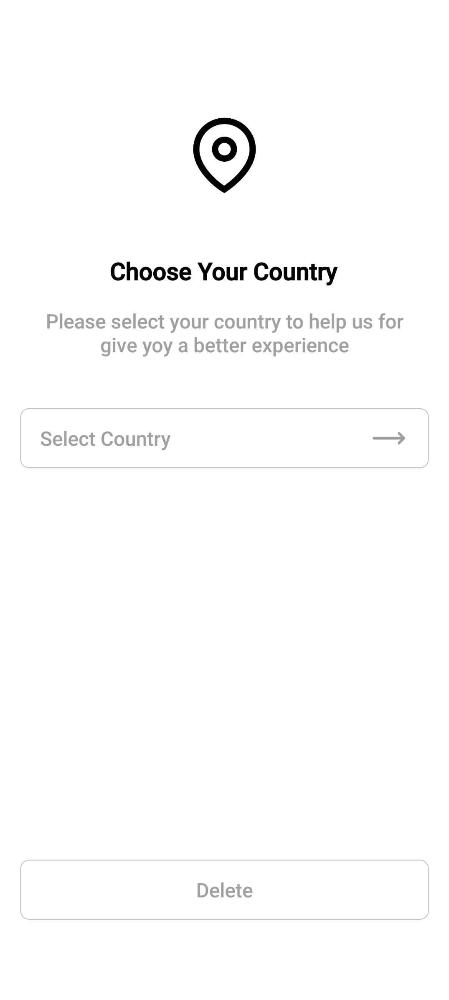
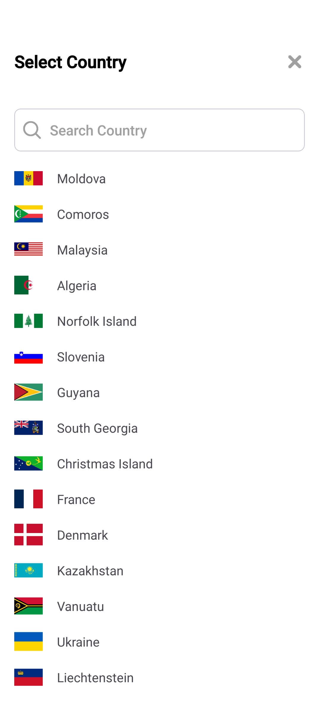

# 🌍 Country Selector App (MVVM + Hilt)

**Country Selector App** is a modern Android application built using **Jetpack Compose**, **MVVM**, and **Clean Architecture** principles. It allows users to **select**, **search**, and **store** a selected country using **local in-memory data** and **remote API** (RESTful service). The app emphasizes **state management**, **recomposition**, and **modular structure** for better scalability.

---

## 📸 Screenshots

| Home Screen | Select Country Screen |
|-------------|------------------------|
||  |


---


## ✨ Key Features

- 🔍 **Searchable Country List** from REST API
- 🏳️ **Country Selection with Flag & Name**
- 🧠 **Selected Country Memory Cache**
- 💬 **Localized Toasts & Feedback**
- 📱 **Responsive Jetpack Compose UI**
- 🧱 **MVVM + Clean Architecture + Hilt**
- 🚦 **Debounced Search Input** (300ms delay)
- 🎨 **Material Design 3 Styling**

---

## 🚀 Tech Stack

| Technology            | Purpose                                |
|-----------------------|----------------------------------------|
| **Kotlin**            | Primary programming language           |
| **Hilt**              | Dependency Injection                   |
| **Retrofit**          | Network layer                          |
| **MVVM**              | Architecture pattern                   |
| **LiveData + State**  | UI reactivity and updates              |
| **ViewModel**         | Business logic & state holder          |
| **Picasso**           | Image loading from URL (flags)         |

---

## 🧠 Architecture Overview

├── data
│ ├── model // API response models
│ ├── repository // Repository implementations
│ ├── remote // Retrofit interface
│ ├── local // In-memory selected country storage
│ └── mapper // data ↔ domain mapping
│
├── domain
│ ├── model // CountryModel (business logic format)
│ ├── interfaces // Repository interfaces
│ └── usecases // UseCase classes (business logic)
│
├── presentation
│ ├── viewmodels // ViewModel classes
│ ├── fragments // UI screens (Home, SelectCountry)
│ ├── adapters // RecyclerView adapters
│ ├── mappers // domain ↔ UI mapping
│ ├── models // UI model (CountryUi)
│ ├── states // Sealed UI states
│ └── utils // Helpers (Picasso, Visibility etc.)
│
├── di
│ └── modules // RetrofitModule for Hilt
│
└── res/layout // ViewBinding XMLs (FragmentHome, FragmentSelectCountry)

yaml
Copy
Edit

---

## 🔄 State Management

- `UiState` sealed class handles:
  - `Loading`
  - `Success(List<CountryUi>)`
  - `Error(Int resId)`

- `SelectCountryViewModel` manages:
  - API calls
  - Search debounce logic
  - Country selection logic

- `HomeViewModel` handles:
  - Selected country display
  - Clear selection functionality

---

## 📦 UseCases

| UseCase                     | Purpose                                 |
|----------------------------|------------------------------------------|
| `GetCountriesUseCase`      | Fetch list of countries from API         |
| `SetSelectedCountryUseCase`| Store the selected country               |
| `GetSelectedCountryUseCase`| Retrieve currently selected country      |
| `ClearSelectedCountryUseCase`| Reset the selected country             |
| `SearchCountriesUseCase`   | Filter country list by name              |

---

## 🎮 UI Components

| Fragment                  | Description                               |
|---------------------------|-------------------------------------------|
| `HomeFragment`            | Shows selected country or placeholder     |
| `SelectCountryFragment`   | Allows user to search and pick a country  |

| ViewModel                 | Role                                      |
|---------------------------|-------------------------------------------|
| `HomeViewModel`           | Selected country state manager            |
| `SelectCountryViewModel`  | Country list, search, selection logic     |

---

## ▶️ Getting Started

### ✅ Prerequisites

- Android Studio Giraffe or newer
- Kotlin 1.8+
- Internet connection (for API)

---

### 🛠️ Setup Instructions

1. **Clone the repository**
   ```bash
   git clone https://github.com/your-username/country-selector-app.git
   cd country-selector-app
Open in Android Studio

Sync Gradle & Run the App

🔗 API Used
https://restcountries.com/v3.1/all
Returns JSON list of all countries (name + flag)

